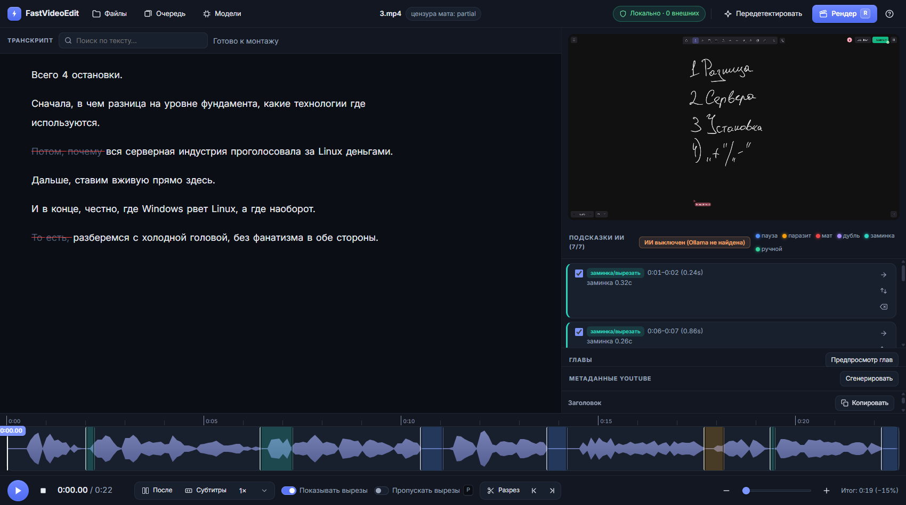
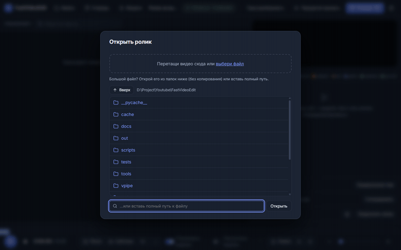
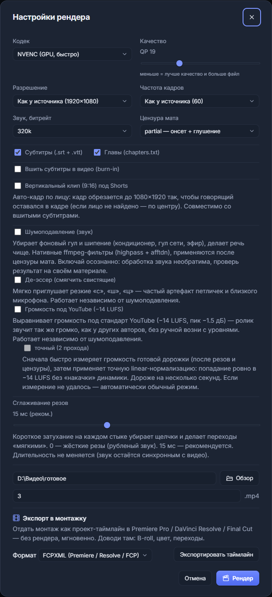
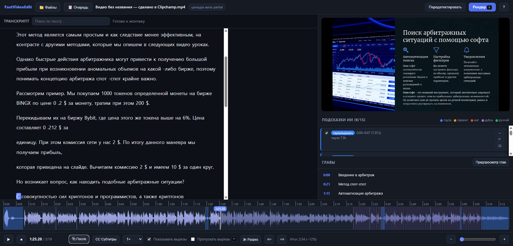

# FastVideoEdit


[](https://github.com/Rxd-essss/FastVideoEdit/actions/workflows/ci.yml)

A **local** talking-head video pipeline for YouTube, with a visual web editor
(UI in Russian). Transcription runs on your GPU, the "smart" steps run on a local
LLM, and the final render uses NVENC. Built and tested on Windows 11 + RTX 3080
(8 GB) + 64 GB RAM.

**Why this instead of Gling / CapCut?** The same auto-cut workflow — but
**free and unlimited**: $0, MIT, no subscription, no upload quotas, no
watermarks. Tuned for **Russian speech** (filler/profanity dictionaries, RU
subtitle reading-speed rules), and your footage never leaves your machine.
Benchmark: **0 % clipped words** across 129 auto-cuts
([§7](#7-cut-quality-benchmark)).

*Коротко: как Gling, только бесплатно ($0, MIT), без подписки и безлимитно,
локально и под русскую речь.*

> **Приватность.** Вся обработка локальна: распознавание речи (Whisper на вашем
> GPU), ИИ-подсказки (Ollama на localhost), монтаж (ffmpeg) — на вашей машине;
> ваше видео и транскрипт не загружаются на сторонние серверы. Первый запуск
> однократно скачивает модель Whisper (~3 ГБ для large-v3) с Hugging Face — после этого можно
> работать полностью офлайн (оффлайн-режим, флаг `--offline`, блокирует исходящие
> сетевые соединения процесса; работает с локальным Ollama на localhost).



*Веб-редактор: транскрипт, плеер, список вырезов и волна с цветными регионами — всё локально.*



*Полный цикл за полминуты: открыли клип — вырезы уже найдены, превью без рендера, рендер с прогрессом, на выходе −15 % длительности + субтитры, главы и метаданные.*

<details>
<summary><strong>Ещё скриншоты</strong></summary>

| | |
|---|---|
|  |  |
| *Диалог рендера: кодек, вшитые сабы, 9:16 Shorts, шумодав, −14 LUFS, NLE-экспорт* | *Транскрипт + YouTube-метаданные + клипы для Shorts* |

</details>

It takes a raw talking-head `.mp4` and produces:

1. a cleaned `.mp4` (quality preserved — one high-quality re-encode),
2. YouTube subtitles (`.srt` + `.vtt`, separate files — not burned in),
3. `chapters.txt` ready to paste into the video description.

Along the way it automatically:

- removes **pauses / dead air**,
- removes acoustic **hesitations** — stretched «э-э-э»/«м-м», mumbling and
  micro-cutoffs that the text detectors miss, found by an acoustic VAD detector
  straight off the waveform,
- removes **filler words** (`fillers_ru.yaml` — editable),
- **censors profanity** so a human still recognizes the word but YouTube's ASR
  does not (`profanity_ru.yaml` — editable),
- **suggests bad takes** (false starts, repeats, rambling) via a local LLM — you
  confirm them,
- generates **chapters** by meaning,
- drafts **YouTube metadata** (title / description / tags / hook) with the local
  LLM (qwen3) — written to `metadata.txt`, copyable from the editor.

It can also, on request:

- **burn in karaoke subtitles** (`.ass` via libass — Cyrillic, per-word
  highlight) instead of the separate `.srt`/`.vtt`,
- **resize to 9:16 for Shorts** with an optional auto face-crop (OpenCV),
- **denoise the audio** (ffmpeg `highpass` + `afftdn`, optional `dynaudnorm`)
  after censoring,
- **export to an NLE** — FCPXML + EDL (CMX3600) for Premiere / Resolve / FCP,
  if you'd rather finish the edit in your own timeline,
- swap the local **Whisper / LLM models** from the editor UI.

The principle is non-destructive: the AI proposes a **cut list**, you review and
edit it, *then* it renders.

---

## Quick start (Windows)

```powershell
winget install Gyan.FFmpeg    # one-time; open a NEW terminal afterwards
.\run.bat                     # creates .venv + installs deps, then opens the editor
```

Браузер откроется на `http://127.0.0.1:8000`: выберите клип в панели «Файлы»,
просмотрите предложенные вырезы (паузы/филлеры уже найдены) и нажмите
**«Рендер»**. Ничего руками править не нужно — всё дальше делается мышкой.
ИИ-подсказки (неудачные дубли, главы, метаданные) опциональны — для них
поставьте Ollama ([§1](#1-install-windows)).

---

## 1. Install (Windows)

### Platform support

- **Windows 11** — the primary and only fully tested platform. Everything in this
  README (launcher `run.bat` / `run.ps1`, NVENC render, CUDA transcription) is
  verified here.
- **Linux** — the core pipeline and the unit tests are cross-platform (pure
  Python + ffmpeg; `pytest` needs no GPU). The unit-test suite runs in CI on
  every push, on **Ubuntu and Windows × Python 3.11/3.12** (no ffmpeg/Ollama on
  the runners — the tests mock both), but the **end-to-end flow has not been
  tested on Linux**. There is no launcher: create a venv, `pip install -r
  requirements.txt`, then run `python serve.py` from the venv. Install ffmpeg
  from your package manager (`apt install ffmpeg` etc.).
- **macOS** — not tested. NVENC is unavailable there; the x264 fallback works
  (pick `x264` in the render settings or `config.yaml`).
- **GPU is optional** — without CUDA, transcription automatically falls back to
  CPU (much slower, but functional). Rendering falls back to x264 likewise.
- **Python 3.11 / 3.12** (developed and tested on 3.12).

> A pinned snapshot of the author's known-good environment lives in
> [`requirements.lock`](requirements.lock) — use it only if the regular
> `requirements.txt` install misbehaves and you want to reproduce the exact
> tested versions.

### Prerequisites (system, one-time)

```powershell
winget install Gyan.FFmpeg       # ffmpeg + ffprobe (full build: NVENC + rubberband)
winget install Ollama.Ollama     # local LLM runtime (optional but recommended)
```

> Open a **new** terminal afterwards so the updated PATH is picked up.
> Verify: `ffmpeg -version`, `ollama --version`.

**CUDA:** you do **not** need the full CUDA Toolkit. The Python deps include the
CUDA 12 runtime libraries (`nvidia-cublas-cu12`, `nvidia-cudnn-cu12` = cuDNN 9),
which faster-whisper loads automatically. You just need a recent NVIDIA driver
(this project was built against driver 595 / CUDA 13.2 — backward compatible with
the CUDA 12 runtime).

### Python environment

**Easiest — use the launcher** (creates `.venv` + installs deps on first run, then starts the editor). Double-click **`run.bat`**, or in PowerShell:

```powershell
.\run.ps1                 # open the editor (pick a clip in the UI)
.\run.ps1 --video x.mp4   # or open a specific clip
.\run.ps1 --port 8001     # if 8000 is busy
```

> Always launch through `run.bat` / `run.ps1` (or the venv). Running `python serve.py`
> with your **system** Python fails with `No module named 'yaml'` — the dependencies
> live in the project's `.venv`, not in the global interpreter.

Manual setup (equivalent to what the launcher does):

```powershell
py -3.12 -m venv .venv
.\.venv\Scripts\Activate.ps1
pip install -r requirements.txt
```

### Pull the LLM model

```powershell
ollama pull qwen3:8b
```

`qwen3:8b` is a **text-only** ~8B model (Q4_K_M, ~5.2 GB) that fits in 8 GB VRAM
with room to spare. Alternatives (set `llm.model` in `config.yaml`):

| Model | Pull | Notes |
|---|---|---|
| `qwen3:8b` *(default)* | `ollama pull qwen3:8b` | Text-only, fits 8 GB, strong Russian |
| Saiga (RU finetune) | `ollama pull ilyagusev/saiga_llama3` | Smoother Russian titles, tighter on VRAM |
| Qwen3-30B-A3B (MoE) | `ollama pull qwen3:30b-a3b` | Smarter; offloads experts to RAM, slower |

The LLM only powers **bad-take suggestions** and **chapters**. Without it, the
pipeline still does pauses, fillers, profanity and subtitles, and falls back to an
even-split for chapters.

---

## 2. Web editor (recommended)

A local visual editor (like Gling) for reviewing and trimming before render:

```powershell
python serve.py --video input.mp4 --out ./out          # open a specific clip
python serve.py --out ./out                             # …or start empty and pick a clip in the UI
python serve.py --start <folder> --no-browser --port 8000   # set browse root, don't auto-open a browser
```

> Run through `run.bat` / `run.ps1` (or the project's `.venv`) — system Python
> lacks the deps. Flags: `--video` open a clip · `--start <folder>` set the file
> browser's start folder · `--out <dir>` output folder · `--config FILE` ·
> `--host` / `--port` · `--no-llm` disable the local LLM · `--no-browser` don't
> auto-open a browser · `--offline` block the process's outbound connections to
> anything but localhost.

Opens `http://127.0.0.1:8000`. **Choosing/switching clips:** the **«Файлы»** panel
(top-left) lets you browse local folders, open a video by clicking it, paste a full
path, or drag-and-drop / upload a file. Launched without `--video`, the picker opens
automatically; use `--start <folder>` to set where browsing begins.

It reuses the same `vpipe` pipeline — no logic is duplicated. You get:

- HTML5 player + **audio waveform** (wavesurfer.js v7) with each cut shown as a
  **colored region** (pause / filler / profanity / bad-take / manual);
- a **transcript panel** — click any word to jump the video there, the current
  word highlights during playback, removed words are struck through;
- a **cut list** with type badges, enable/disable toggles, remove↔censor switch,
  and per-cut jump/delete;
- a live **"after" duration** and a **preview-montage** mode that plays the video
  while skipping the enabled cuts (no render needed);
- **manual cutting** two ways: drag on the waveform, or select transcript text and
  press `X` / click the floating «✂ Вырезать»;
- a **Render settings** dialog (encoder NVENC/x264, quality, resolution & fps that
  default to the source, audio bitrate, censor method, subtitles/chapters toggles,
  **burn-in karaoke subtitles**, **9:16 Shorts** resize, **audio denoise**,
  **swap Whisper / LLM model**, **output folder** + filename), with a live
  progress bar (SSE) and result links;
- a **batch render queue** that survives a server restart (the queue is persisted
  to disk and restored on startup), with a **Stop** button;
- an **NLE export** button (FCPXML + EDL) to continue the edit in Premiere /
  Resolve / FCP;
- a **zero-upload badge** proving locality, plus the offline mode (`--offline`)
  that blocks the process's outbound connections to anything but localhost;
- a **sync nudge** (`;` / `'`) to shift the word highlight if Whisper's word
  timestamps feel slightly ahead/behind the audio (±50 ms per press, remembered).

Edits autosave to `out/<name>.cutlist.json`, so the CLI and the web editor share
the same cut list.

**Hotkeys:** `Space` play/pause · `←/→` ±5 s · `,`/`.` frame step · `I`/`O`
in/out marks · `M` cut from marks · `X` cut selected words · `Enter` toggle cut ·
`C` remove↔censor · `Del` delete manual cut · `P` preview-montage · `;`/`'` sync
nudge · `S` save · `R` render settings · `?` help.

---

## 2b. CLI pipeline (no browser)

Prefer the terminal? The same engine runs headless. Activate the venv first
(`.\.venv\Scripts\Activate.ps1`), or call its interpreter explicitly —
`.\.venv\Scripts\python.exe pipeline.py …` — system Python lacks the deps.

### Step 1 — detect and review (stops for you)

```powershell
python pipeline.py input.mp4 --out ./out
```

This probes, transcribes (cached), detects cut candidates, writes the cut list,
and **stops**:

- `out/input.cutlist.json` — the editable cut list,
- `out/input.cutlist.txt` — a readable summary (timecodes + reasons).

### Step 2 — edit the cut list

Open `out/input.cutlist.json` and adjust each segment (or open the clip in the
web editor — [§2](#2-web-editor-recommended) — and do the same with the mouse:
both edit the same file):

- `"enabled": true/false` — apply this cut or keep that part,
- `"action": "remove" | "censor"` — delete it, or (for profanity) censor audio.

Bad-take suggestions start with `"enabled": false` — flip the ones you agree with.

### Step 3 — render

```powershell
python pipeline.py input.mp4 --out ./out --apply
```

Produces `out/input.mp4`, `out/input.srt` (+ `.vtt`), `out/transcript.txt`,
`out/chapters.txt`, and prints a summary (before/after duration, cuts by type,
words censored, time saved).

> Tip: `--apply` with **no** existing cut list runs detection then renders in one
> shot (handy for testing). Re-runs are idempotent; originals are never touched.

### Useful flags

```
--config FILE          use a different config (default: config.yaml)
--apply                render using the (edited) cut list
--redetect             rebuild the cut list from the transcript (overwrites it)
--no-llm               skip the LLM (bad-takes off, chapters use fallback)
--censor-method M      partial | pitch | lowpass | reverse  (override config)
--device cuda|cpu      override transcription device
--model NAME           override the whisper model (e.g. large-v3-turbo, medium)
```

> A plain re-run (no `--apply`) never overwrites your hand-edited cut list — use
> `--redetect` if you actually want to rebuild it.

---

## 3. Configuration

- **`config.yaml`** — every threshold and option (pause length & padding, whisper
  model/compute type, NVENC/x264 quality, censor method, subtitle limits, LLM,
  chapters). Heavily commented.
- **`fillers_ru.yaml`** — filler words/phrases and stretched mumbles (`э-э-э`).
- **`profanity_ru.yaml`** — profanity matched by **root/stem** (so derived forms
  are caught), plus an `allow` whitelist for innocent look-alikes (`хлеб`, etc.).

### Censoring method (`censor.method`)

| Method | What it does | Trade-off |
|---|---|---|
| `partial` *(default)* | Audible onset + muted vocalic middle (click-free) | Human recognizes it; ASR can't reassemble it |
| `pitch` | Shifts the word up ~6 semitones (rubberband) | Recognizable rhythm, broken formants |
| `lowpass` | Muffles ("underwater") | Simple, milder |
| `reverse` | Reverses the word | Strongest ASR defeat, lower human clarity |

Masking of profanity **in the subtitle text** (e.g. `б***ь`) is set under
`masking:`.

> These reduce automatic recognition; they do not guarantee 100 %. Tune
> `censor.partial.onset` / `mute_fraction` to taste.

---

## 4. How it works (stages)

1. **Probe** — ffprobe; extract 16 kHz mono WAV.
2. **Transcribe** — faster-whisper `large-v3` `int8_float16` on CUDA (auto OOM
   fallback `large-v3 → medium → small`, then CPU). Cached by input hash.
3. **Detect** — pauses (word-gap silence), fillers (regex), profanity (roots),
   bad takes (LLM) → one editable cut list.
4. **Censor** — audio-only filtergraph; video kept bit-exact.
5. **Review** — stop and let you edit the cut list: visually in the web editor
   ([§2](#2-web-editor-recommended)) or as JSON in the CLI flow
   ([§2b](#2b-cli-pipeline-no-browser)).
6. **Render** — two stages: lossless censored audio, then a **single** frame-accurate
   cut + NVENC encode (`-rc constqp -qp 19 -preset p7`), AAC 320k, `+faststart`.
7. **Subtitles** — word timestamps remapped onto the cut timeline; `.srt`/`.vtt`
   with Russian reading-speed limits; profanity masked.
8. **Chapters** — LLM splits the final transcript into themed chapters; enforced
   to YouTube's rules (first `00:00`, ≥3, ≥10 s, ascending).
9. **Summary**.

---

## 5. Project layout

```
pipeline.py        CLI (stages 1–9)
config.yaml        all settings
fillers_ru.yaml    editable filler list
profanity_ru.yaml  editable profanity roots + allow-list
vpipe/             the pipeline package (reused by the web UI)
tests/             unit tests for the pure logic
serve.py           web editor (FastAPI) — reuses vpipe
web/               editor frontend (vanilla JS + wavesurfer.js v7)
web/vendor/        wavesurfer.js v7 vendored locally (no CDN — fully offline)
```

## 6. Tests

```powershell
.\.venv\Scripts\python.exe -m pytest -q
```

## 7. Cut quality (benchmark)

Качество авто-монтажа измеряется скриптом [`scripts/benchmark_cuts.py`](scripts/benchmark_cuts.py)
по кэшированным транскриптам (GPU не нужен). Срез от 2026-06-10, 4 клипа (~30 мин речи):

| Авто-вырезов | Слов задето (клиппинг >12 мс) | Нарушений |
|---:|---:|---:|
| 129 | 0 | 0.0 % |

Методика, полные таблицы и честные оговорки (метрики чистоты — прокси) — в
[docs/BENCHMARK.md](docs/BENCHMARK.md). Воспроизвести на своих клипах:

```powershell
.\.venv\Scripts\python.exe scripts\benchmark_cuts.py мой_клип.mp4
```

## 8. Roadmap

- [x] Core CLI pipeline (stages 1–9)
- [x] Web editor (FastAPI + wavesurfer.js v7): waveform with colored regions,
      click-to-seek transcript, manual cutting, preview-montage, hotkeys, render
      with live progress.
- [x] Acoustic hesitation detector (VAD over the waveform).
- [x] Auto YouTube metadata (title / description / tags / hook) via the local LLM.
- [x] Burn-in karaoke subtitles (`.ass` / libass, per-word highlight).
- [x] 9:16 Shorts resize with auto face-crop (OpenCV).
- [x] Audio denoise (ffmpeg `afftdn` + `highpass`).
- [x] NLE export (FCPXML + EDL for Premiere / Resolve / FCP).
- [x] Zero-upload badge + offline mode (`--offline`).
- [x] Swap local Whisper / LLM models from the UI.
- [x] Persistent batch render queue (survives a restart).
- [x] Undo/redo (Ctrl+Z / Ctrl+Shift+Z), drag region edges with word-snapping
      (Alt — отключить снэп), «До/После» предпросмотр финального таймлайна (A).
- [x] Editable transcript (double-click a word to fix a Whisper typo;
      select text + Del → cut), loudness mastering (−14 LUFS, 1- и 2-pass),
      neural denoise engine (DeepFilterNet 3, opt-in).
- [x] **Clip Maker**: локальная LLM предлагает кандидатов под Shorts
      (хук-фраза, 20–60 с, без пересечений); рендер выбранных — 9:16 с
      face-crop по диапазону, караоке-сабами и внутренними вырезами.

## 9. Troubleshooting

- **Транскрипция падает с ошибкой про прокси** (`Unknown scheme for proxy URL
  'socks4://…'`): системный прокси Windows (VPN/прокси-клиент) несовместим с
  huggingface_hub. Редактор автоматически повторяет загрузку модели без прокси;
  если не помогло — отключите прокси-клиент на время первой загрузки модели,
  задайте `HTTP_PROXY=http://…` вместо socks, либо укажите модель локальным
  путём в `config.yaml` (`transcribe.model`) — локальный путь сеть не использует.
- **Первый запуск «висит» на транскрипции** — идёт разовая загрузка модели
  Whisper (~3 ГБ для large-v3); прогресс виден в строке статуса. Дальше всё
  работает офлайн.

---

## Лицензия

FastVideoEdit распространяется под лицензией **MIT** — см. [`LICENSE`](LICENSE).

История изменений — в [CHANGELOG.md](CHANGELOG.md). Хотите помочь проекту —
загляните в [CONTRIBUTING.md](CONTRIBUTING.md) (dev-окружение, тесты, стиль).

## Сторонние компоненты / Third-party

FastVideoEdit использует следующие сторонние компоненты (каждый под своей
лицензией):

- **[wavesurfer.js](https://github.com/katspaugh/wavesurfer.js)** v7.12.7 — BSD
  3-Clause. Завендорен локально в `web/vendor/` (без CDN). Текст лицензии:
  [`web/vendor/LICENSE-wavesurfer`](web/vendor/LICENSE-wavesurfer).
- **[faster-whisper](https://github.com/SYSTRAN/faster-whisper)** — MIT
  (распознавание речи; тянет CTranslate2 — тоже MIT).
- **[opencv-python](https://github.com/opencv/opencv-python)** — Apache-2.0
  (опционально, для авто-кадра лица при ресайзе 9:16).
- **[FFmpeg](https://ffmpeg.org/)** — внешняя зависимость (LGPL/GPL в зависимости
  от сборки), вызывается как отдельный процесс; в комплект не входит, ставится
  пользователем.
- **[Ollama](https://ollama.com/)** + модель **qwen3** — локальный LLM-рантайм
  (внешняя зависимость), используется для подсказок и метаданных.
- **[YuNet](https://github.com/opencv/opencv_zoo/tree/main/models/face_detection_yunet)**
  (`vpipe/data/face_detection_yunet_2023mar.onnx`, ~230 КБ) — MIT, детектор лица
  для авто-кадра 9:16 (фолбэк — Haar-каскад OpenCV).
- **[DeepFilterNet](https://github.com/Rikorose/DeepFilterNet)** v0.5.6 —
  MIT/Apache-2.0, опциональный нейро-движок шумоподавления. Бинарь в комплект
  не входит: скачайте `deep-filter-0.5.6-x86_64-pc-windows-msvc.exe` со страницы
  релизов и положите как `tools/deep-filter.exe` (либо в PATH). Без него
  используется стандартный движок afftdn.
